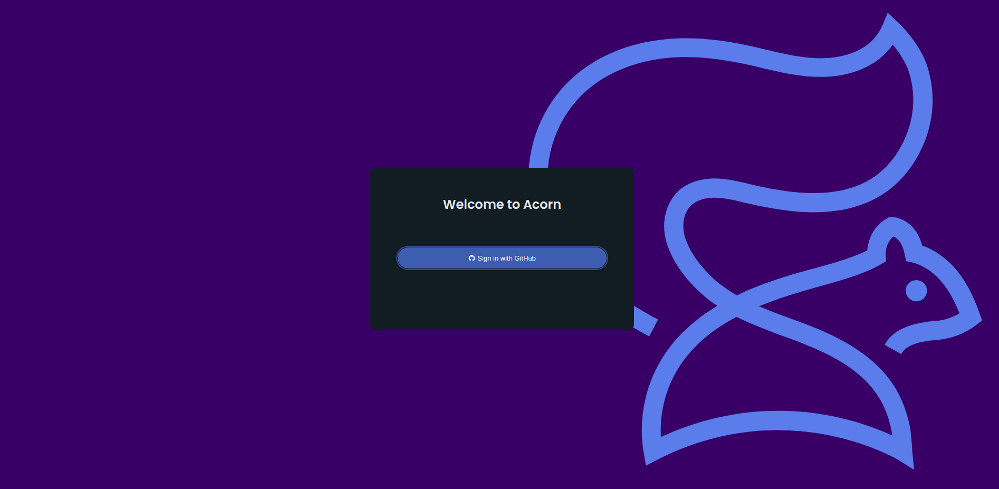

# Deploying Mern Stack Application

The MERN stack is a web development framework made up of the stack of MongoDB, Express.js, React.js, and Nodejs. It is one of the several variants of the MEAN stack.

[Acorn](http://www.acorn.io) is a cloud computing platform with a big free sandbox that anyone can use by registering with a GitHub account. It is designed to simplify running modern  cloud-native apps on the public cloud. You use familiar development and deployment workflows based on mainstream container tools without having to deal with provisioning or configuring any underlying cloud resources. Basically it provides all the power of Kubernetes and Terraform, without any of the complexity.

To deploy an application on Acorn we need to define our application as an Acornfile, which will produce the Acorn Image that we can deploy on the platform.  In this tutorial, we will explore how to provision a sample MERN Application on Acorn.

If you’re the kind of person who likes to skip to the end, you can [deploy the sample application in your sandbox now](https://acorn.io/run/ghcr.io/infracloudio/mern-acorn:v1.%23.%23-%23?ref=slayer321&name=mern) and just start poking around in it.  Sandbox deployments in Acorn are restricted by size, and run for two hours, so it should provide plenty of time for you to evaluate and test anything. You can start them over as often as you like, or you can upgrade to a paid Pro account if you want to run something in production. 

If you want to follow along, I’ll walk through the steps to deploy the simple MERN stack application using Acorn, which is following the standard [MongoDB sample application guide](https://www.mongodb.com/languages/mern-stack-tutorial) which creates a simple Record List for Employees.


_Note: Everything shown in this tutorial can be found in [this repository](https://github.com/infracloudio/mern-stack-acorn)_.

## Pre-requisites

- [Acorn CLI](https://docs.acorn.io/installation/installing)
- Github account to sign up for the Acorn Platform.

## Acorn Login
Login to the [Acorn Platform](http://beta.acorn.io) using the Github Sign-In option with your Github user.


After the installation of Acorn CLI for your OS, you can login to the Acorn platform.
```
$ acorn login beta.acorn.io
```

## Create the MERN Application
In this post we will create a simple MERN app from the [MongoDB sample application guide](https://www.mongodb.com/languages/mern-stack-tutorial). It is a simple application that provides standard CRUD features which act as a Record List for Employees.

In the Acorn platform, there are two ways you can try this sample application.
1. Using Acorn platform dashboard.
2. Using CLI

The First way is the easiest one where, in just a few clicks you can deploy the MERN application on the platform and start using it. However, if you want to customize the application or want to understand how you can run your own MERN applications using Acorn, use the second option.

## Running the application using Dashboard

In this option you use the published Acorn application image to deploy the MERN sample application in just a few clicks. It allows you to deploy your applications faster without any additional configurations. Let us see below how you can deploy the mern app to the Acorn platform dashboard.

1. Login to the [Acorn Platform](https://acorn.io/auth/login)  using the Github Sign-In option with your Github user.
2. Select the “Create Acorn” option.
3. Choose the source for deploying your Acorns
   3.1. Select “From Acorn Image” to deploy the sample Application.


   3.2. Provide a name "Mern Sample Acorn”, use the default Region and provide the URL for the Acorn image and click Create.
```
ghcr.io/infracloudio/mern-acorn:v1.#.#-#
```


_Note: The App will be deployed in the Acorn Sandbox Environment. As the App is provisioned on AcornPlatform in the sandbox environment it will only be available for 2 hrs and after that it will be shutdown. Upgrade to a pro account to keep it running longer_.

4. Once the Acorn is running, you can access it by clicking the Endpoint or the redirect link.
   4.1. Running Application on Acorn
   
   4.2. Running MERN app
   


## Running the Application using acorn CLI
As mentioned previously, running the acorn application using CLI lets you understand the Acornfile. With the CLI option, you can customize the sample app to your requirement or use your Acorn knowledge to run your own MERN application.

To run the application using CLI you first need to clone the source code repository on your machine.

```
$ git clone https://github.com/infracloudio/mern-stack-acorn.git
```
Once cloned here’s how the directory structure will look.


### Understanding the Acornfile

We have the sample MERN Application ready. Now to run the application we need an Acornfile which describes the whole application without all of the boilerplate of Kubernetes YAML files. The Acorn CLI is used to build, deploy, and operate Acorn on the Acorn cloud platform.  It also can work on any Kubernetes cluster running the open source Acorn Runtime. 


Below is the Acornfile for deploying the Mern app that we created earlier:


There are 3 requirements for running MERN Application
- Client
- Server
- DB

The above Acornfile has the following elements:

- **Args**: Which is used to take the user args.
- **Services**:  Here we're using the [MongoDB](https://github.com/acorn-io/mongodb) service that is built into Acorn as an [Acorn Service](https://docs.acorn.io/reference/services).
- **Containers**:  We define a two container named client and server which define the following configurations:
   - **Server**: 
       - **build**:  details required to build a Mern server Application
       - **dirs**: this field is used to mount our application to a specific directory.
       - **ports**:  port where our laravel application is listening on.
       - **env**:  In the env section we are providing all the env variables which the server application will be using.
       - **consumes**: here server consumes DB
   - **Client**: 
       - **build**:  details required to build a Mern client Application
       - **dirs**: this field is used to mount our application to a specific directory.
       - **ports**:  port where our laravel application is listening on.
       - **env**:  In the env section we are providing all the env variables which the server application will be using.
       - **memory**: memory used by client
       - **dependsOn**: here client depends on server

### Running the Application
We have already logged in using Acorn CLI now you can directly deploy applications on your sandbox on the Acorn platform. Run the following command from the root of the directory.

```
$ acorn run -n mern-app -i
```

Below is what the output looks like.


## The Mern Application

To use this application click on the link given by Acorn Platform. This will show you the application home page. Here you can create Employees in Record List. Once added you can edit and delete it as well.


## Running the app in dev mode

If you are developing your application and don't want to start and stop the application everytime you make the changes you can use the incredibly helpful Acorn Dev Mode.Running in dev mode allows you to do continous development of the application, and have your running instance reflect the changes as soon as you save your changes. Run the following command.

```
$ acorn dev -n mern-app .
```

## Push an artifact to a registry

Using the Dev mode you can easily modify the application as per your requirement and once the application is working as expected and is ready to be built and packaged, push it to a registry. You can push it to any OCI registry. We will use Github Container Registry in this example. Once published, you can use the acorn image to deploy it directly in the Acorn platform using the dashboard or CLI, as described previously.

### Log in to the registry
Log in to the registry with the command below and follow the prompts.

```
$ acorn login ghcr.io
```
### Build and push the image
Build and push the image with the below command.

```
$ acorn build --push -t ghcr.io/infracloudio/mern-acorn:v1.0.0-0
```
Once the application is built and pushed you can use those images to run your application on Acorn Platform.

## What's Next?

1. The App is provisioned on Acorn Platform and is available for two hours. Upgrade to Pro account for anything you want to keep running longer.
2. After deploying you can edit the Acorn Application or remove it if no longer needed. Click the Edit option to edit your Acorn's Image. Toggle the Advanced Options switch for additional edit options.
3. Remove the Acorn by selecting the Remove option from your Acorn dashboard.


## Conclusion
In this tutorial we show how we can use the Acornfile and get our Mern application up and running and it’s very easy to make changes to the Application file when you are developing it without the need of restarting your application. And If you are looking to run the application directly you can run it on Acorn Platform by providing the image name. 
